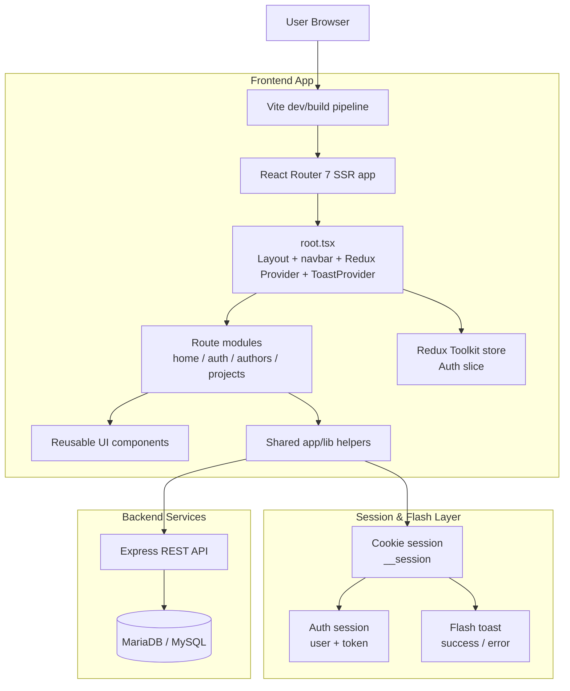
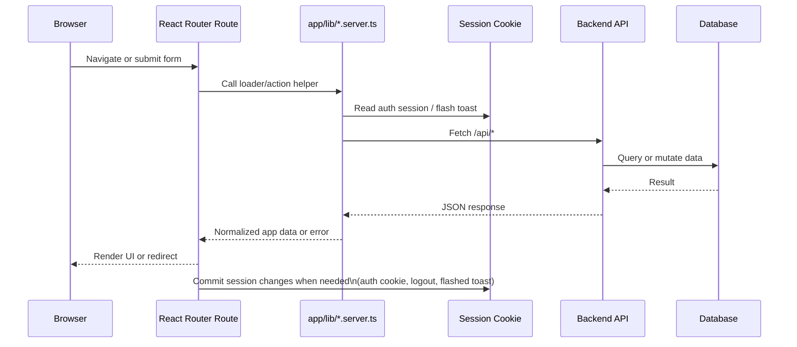
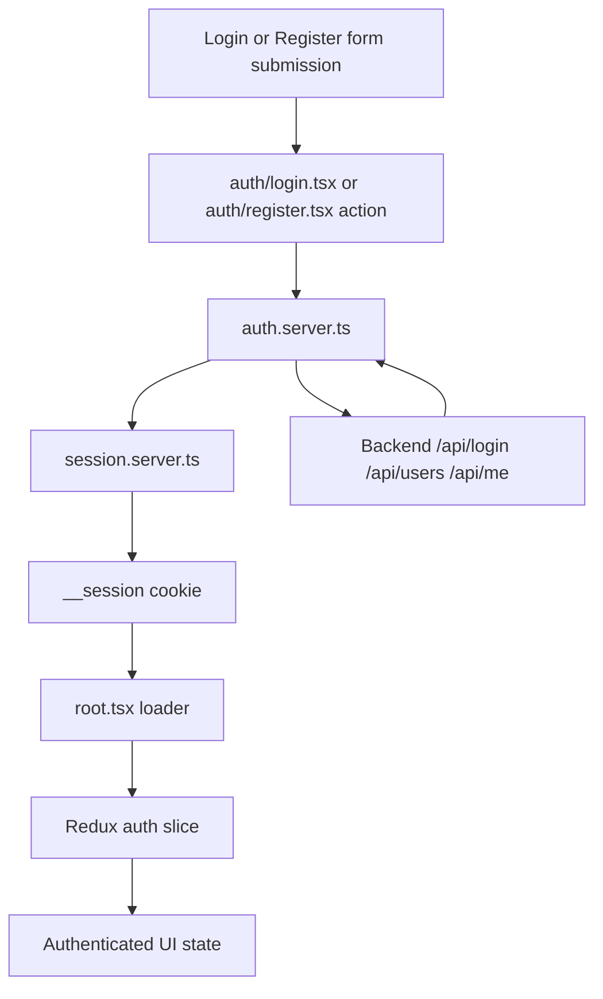
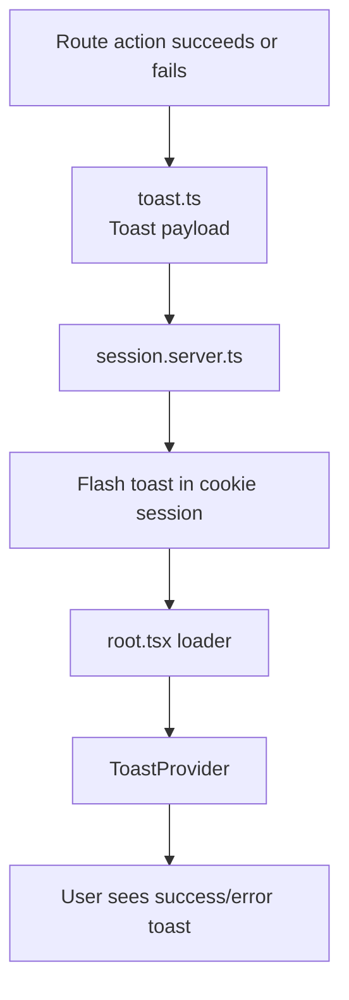
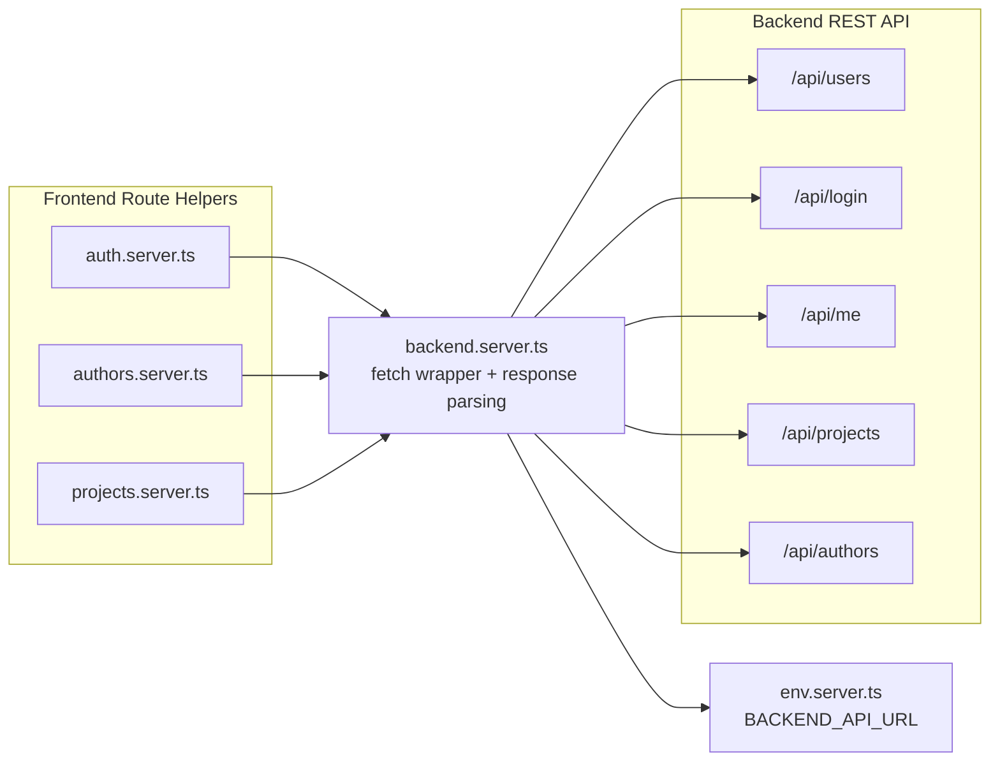
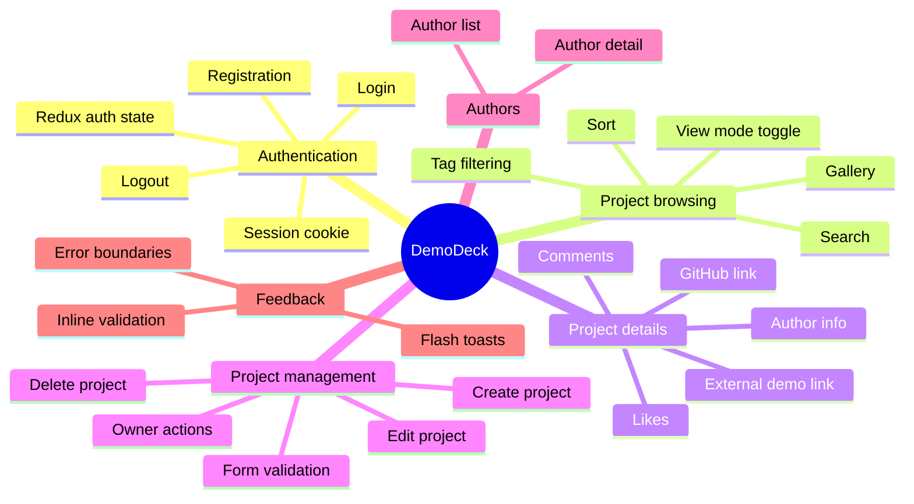

# DemoDeck Architecture Diagram

This document provides a more detailed view of the project architecture, including the frontend routing layer, shared infrastructure, session/auth flow, and the connection to the backend API.

## 1. High-Level Architecture

## 2. Frontend Module Structure

```mermaid
flowchart LR
    subgraph APP["app/"]
        ROOT["root.tsx\nGlobal shell"]
        ROUTESCFG["routes.ts\nRoute tree definition"]

        subgraph ROUTES["routes/"]
            HOME["home.tsx"]
            LOGIN["auth/login.tsx"]
            REGISTER["auth/register.tsx"]
            AUTHORS["authors/authorsList.tsx"]
            AUTHOR["authors/authorDetail.tsx"]
            PROJECT["projects/projectDetail.tsx"]
            NEWPROJECT["projects/newProject.tsx"]
            EDITPROJECT["projects/editProject.tsx"]
            MIDDLEWARE["middleware.tsx\nProtected route wrapper"]
            NOTFOUND["notFound.tsx"]
        end

        subgraph COMPONENTS["components/"]
            NAV["Navbar"]
            LIST["ProjectList / ProjectCard"]
            FILTERS["SearchInput / TagFilters / SortSelect / ViewModeToggle"]
            AUTHSCREEN["AuthScreen"]
            EDITOR["ProjectEditorForm"]
            OWNER["ProjectOwnerActions"]
            TOASTUI["ToastProvider"]
            INFO["InfoBlock"]
        end

        subgraph LIB["lib/"]
            AUTHSRV["auth.server.ts"]
            PROJSRV["projects.server.ts"]
            AUTHS["authors.server.ts"]
            BACKENDSRV["backend.server.ts"]
            SESSIONSRV["session.server.ts"]
            TOASTLIB["toast.ts"]
            PROJECTFORM["project-form.ts"]
            PROJECTMAP["projects.ts"]
        end

        subgraph STATE["state/"]
            AUTHSLICE["auth/authSlice.ts"]
            AUTHTYPES["auth/types.ts"]
        end

        subgraph CONFIG["config/"]
            STORE["store.ts"]
            HOOKS["hooks.ts"]
            ENV["env.server.ts"]
        end
    end

    ROUTESCFG --> ROOT
    ROOT --> NAV
    ROOT --> TOASTUI
    ROOT --> STORE
    STORE --> AUTHSLICE
    AUTHSLICE --> AUTHTYPES
    ROOT --> HOOKS

    HOME --> LIST
    HOME --> FILTERS
    LOGIN --> AUTHSCREEN
    REGISTER --> AUTHSCREEN
    PROJECT --> INFO
    PROJECT --> OWNER
    NEWPROJECT --> EDITOR
    EDITPROJECT --> EDITOR
    MIDDLEWARE --> NEWPROJECT
    MIDDLEWARE --> EDITPROJECT

    HOME --> PROJSRV
    AUTHORS --> AUTHS
    AUTHOR --> AUTHS
    PROJECT --> PROJSRV
    LOGIN --> AUTHSRV
    REGISTER --> AUTHSRV
    NEWPROJECT --> PROJECTFORM
    NEWPROJECT --> PROJSRV
    EDITPROJECT --> PROJECTFORM
    EDITPROJECT --> PROJSRV

    AUTHSRV --> SESSIONSRV
    SESSIONSRV --> TOASTLIB
    AUTHSRV --> BACKENDSRV
    PROJSRV --> BACKENDSRV
    AUTHS --> BACKENDSRV
    BACKENDSRV --> ENV
    PROJECTMAP --> PROJSRV
```

## 3. Request / Data Flow

## 4. Authentication and Session Flow

### Notes

- The session cookie stores the backend token and authenticated user metadata.
- `root.tsx` reads the authenticated session on every request and hydrates the Redux auth slice.
- Protected routes (`projects/new` and `projects/:id/edit`) are guarded through `routes/middleware.tsx` and auth checks inside route actions.

## 5. Toast / Flash Message Flow

### Notes

- Redirect-based actions flash a one-time toast into the session cookie.
- The root loader reads and clears the flash message.
- `ToastProvider` displays global notifications for success and error states.
- Same-page action feedback can also be pushed directly from route components into the toast provider.

## 6. Backend Integration Boundaries

## 7. Functional Areas Covered by the Current Codebase

## 8. Summary

At a high level, the project is a server-rendered React Router application that delegates all business data to a backend REST API. Route loaders and actions are the main orchestration layer: they read session state, call server helpers from `app/lib/`, normalize API responses, and render route components. Global concerns such as authentication, session management, and toast notifications are centralized in the root/session infrastructure, while feature-specific UI lives in route modules and reusable components.
